# Linguagens
## Exercício 1

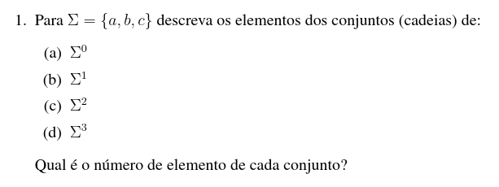

- a) { ε } -> 1 elemento
- b) { a, b, c} -> 3 elementos
- c) { aa, ab, ac, ba, bb, bc, ca, cb, cc } -> 9 elementos
- d) { aaa, aab, aac, aba, abb, abc, aca, acb, acc, baa, bab, bac, bba, bbb, bbc, bca, bcb, bcc, caa, cab, cac, cba, cbb, cbc, cca, ccb, ccc } -> 27 elementos

## Exercício 2

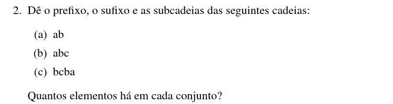

### a) ab

- **Prefixo**: { ε, a, ab } -> 3 elementos
- **Sufixo**: { ε, b, ab } -> 3 elementos
- **Subcadeias**: { ε, a, b, ab } -> 4 elementos

### b) abc

- **Prefixo**: { ε, a, ab, abc } -> 4 elementos
- **Sufixo**: { ε, c, bc, abc } -> 4 elementos
- **Subcadeias**: { ε, a, b, c, ab, bc, abc} -> 7 elementos

### c) bcba

- **Prefixo**: { ε, b, bc, bcb, bcba } -> 5 elementos
- **Sufixo**: { ε, a, ba, cba, bcba } -> 5 elementos
- **Subcadeias**: { ε, a, b, c, ba, bc, cb, bcb, cba, bcba } -> 10 elementos

## Exercício 3

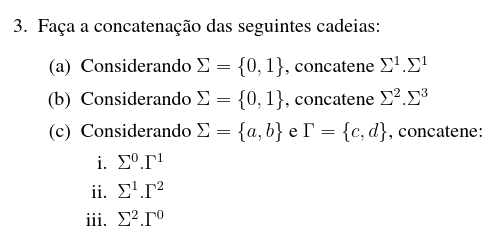

### a) Σ² = { 00, 01, 10, 11 } -> 4 elementos (2²)

### b) Σ⁵ -> 32 elementos (2⁵)

### c) 

1. Σ⁰ . Γ¹ = { c, d } -> 2 elementos
2. Σ¹ . Γ² = { acc, acd, adc, add, bcc, bcd, bdc, bdd} -> 8 elementos
3. Σ² . Γ⁰ = { aa, ab, ba, bb } -> 4 elementos

## Exercício 4

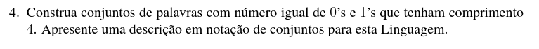

C = { 0011, 0101, 0110, 1001, 1010, 1100 } -> 8 elementos
L = { *w*  ∈ { 0, 1 }⁴ | #0(*w*) = #1(w) = 2 }

## Exercício 5

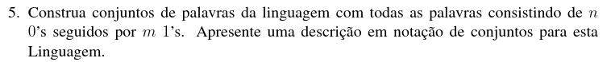

L = { 0ⁿ  1ᵐ | n, m ∈ N }   (N é o conjunto dos números naturais)

Se n = m = 0 -> L = { ε }

## Exercício 6: Dadas as seguintes linguagens

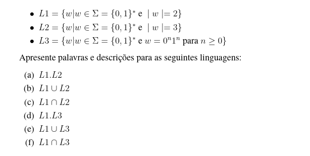

### L1, L2 e L3

- L1 é o conjunto de todas as cadeias binárias de comprimento 2.
- L2 é o conjunto de todas as cadeias binárias de comprimento 3.
- L3 é o conjunto de todas as cadeias binárias que possuem *n* zeros seguidos de *n* uns, incluindo a cadeia vazia.

### a) L1 . L2 

- L1.L2 = { *w* | *w* ∈ {0,1}* e |*w*| = 5 }
- É o conjunto de todas as cadeias binárias de tamanho 5.
- Ex: 00000 e 11101.

### b) L1 ∪ L2

- L1 ∪ L2 = { w | w ∈ {0,1}*  e |w| = 2 ou |w| = 3 }
- É o conjunto de todas as cadeias binárias de tamanho 2 ou de tamanho 3.
- Ex: 00, 01, 10, 11, 000, 001, 010, 011, 100, 101, 110, 111.

### c) L1​∩L2

- Representa a intersecção entre os conjuntos L1 e L2. Entretanto, é impossível existir uma palavra que possua comprimento 2 e comprimento 3 ao mesmo tempo.
- Logo, L1 ​∩ L2 = ∅.

### d) L1 . L3

- L1 . L3 = { 00, 01, 10, 11 } U { 0ⁿ1ⁿ | n ≥ 0 }
- Ex: 00, 01, 10, 11, 0001, 000011, 1101, 110011.

### e) L1 ∪ L3

- L1 ∪ L3 =  { w | w ∈ {0,1}* e |w| = 2 ou w = 0ⁿ1ⁿ para n ≥ 0 }
- Ex: ε, 00, 01, 10, 11, 0011, 000111.

### f) L1 ∩ L3

- L1 ∩ L3 = { w | w ∈ {0,1}* e w = 01 }
- Intersecção entre { 00, 01, 10, 11 } e { ε, 01, 0011, 000111, 00001111, ... } 
- Ex: 01

# Autômatos

## Exercício 7

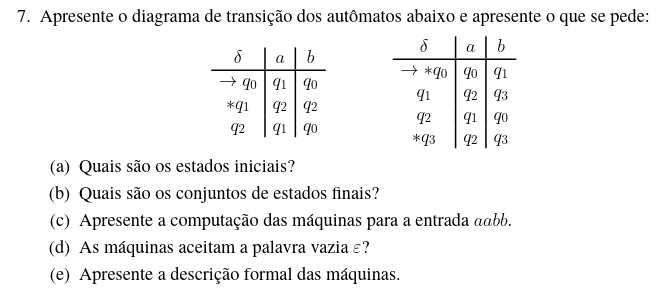

### a) O estado inicial de ambos autômatos é q₀

### b) { q₁ } e { q₀, q₃ }

### c) 

- Primeiro autômato: \[ q₀, aabb ], \[ q₁, abb ], \[ q₂, bb ], \[ q₀, b], \[ q₀ ]
- Segunda autômato: \[ q₀, aabb ], \[ q₀, abb ], \[ q₀, bb ], \[ q₁, b], \[ q₃]

### d) Apenas o segundo autômato aceita a palavra vazia

### e)

Primeiro autômato:

1. *Q*: { q₀, q₁, q₂ }
2. Σ: { a, b },
3. δ: confira a tabela,
4. q₀,
5. *F*: { q₁ }

Segundo autômato:

1. *Q*: { q₀, q₁, q₂, q₃ }
2. Σ: { a, b },
3. δ: confira a tabela,
4. q₀,
5. *F*: { q₀, q₃ }

## Exercício 8

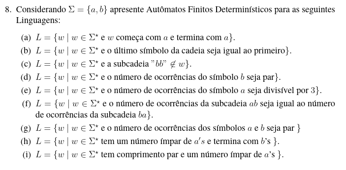

### a) L = { *w* | *w*  ∈ Σ* e *w* começa com *a* e termina com *a* }

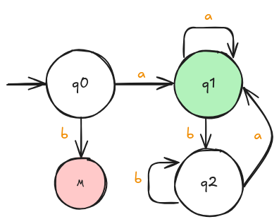

### b) L = { *w* | *w*  ∈ Σ* e o último símbolo da cadeia seja igual ao primeiro }

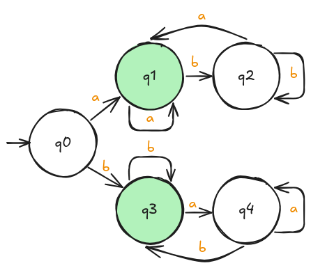

Obs: Esse autômato **não** aceita a palavra vazia. Caso queira mudar isso, basta considerar o estado q0 como um estado de aceitação.

### c) L = { *w* | *w* ∈ Σ* e a subcadeia ”bb” ∉ w }

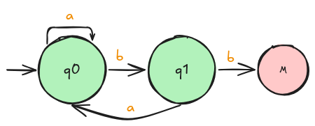

### d) L = { *w* | *w* ∈ Σ* e o número de ocorrências do símbolo b seja par }

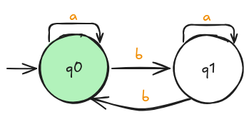

### e) L = { *w* | *w* ∈ Σ* e o número de ocorrências do símbolo a seja divisível por 3 }

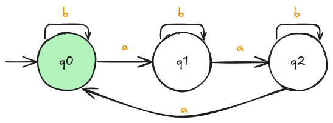

### f) L = { *w* | *w* ∈ Σ* e o número de ocorrências da subcadeia ab seja igual ao número de ocorrências da subcadeia ba }

Obs: Essa linguagem, para este alfabeto { a, b }, é a mesma que a linguagem de todas as palavras que começam e terminam com o mesmo símbolo. Por esse motivo, os autômatos de B e F são iguais.

### g) L = { *w* | *w* ∈ Σ* e o número de ocorrências dos símbolos a e b seja par }

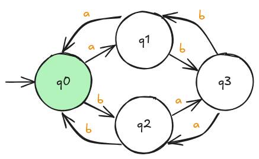

### h) L = { *w* | *w* ∈ Σ* tem um número ímpar de a′s e termina com b’s }

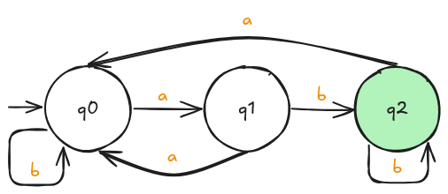

### i) L = { *w* | *w* ∈ Σ* tem comprimento par e um número ímpar de a’s }

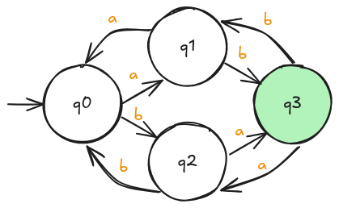

Obs: Observe como esse autômato é quase igual ao autômato da letra g, exceto pelo estado de aceitação.
