# Exercício 1

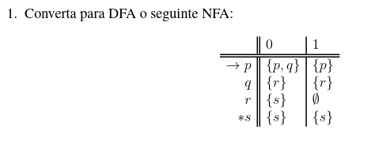

## Tabela de Transições

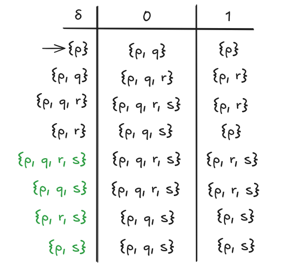

## Desenho

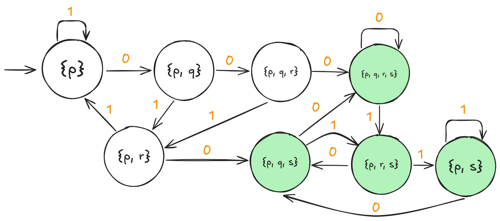

## Descrição Formal

- *Q*: { { p }, { p, q }, { p, q, r }, { p, q, r, s }, { p, q, s }, { p, r }, { p, r, s }, { p, s } },
- Σ: { 0, 1 },
- δ: **consultar tabela**,
- q₀: { p },
- *F*: { { p, q, r, s }, { p, q, s }, { p, r, s }, { p, s } }

# Exercício 2

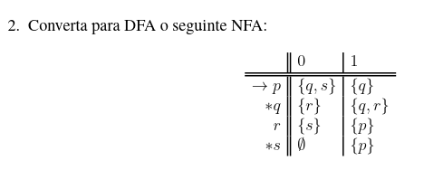

## Tabela de Transições

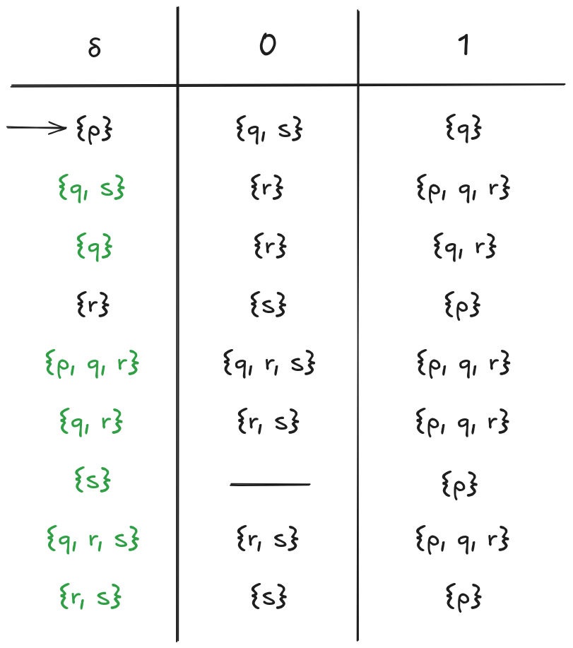

## Desenho

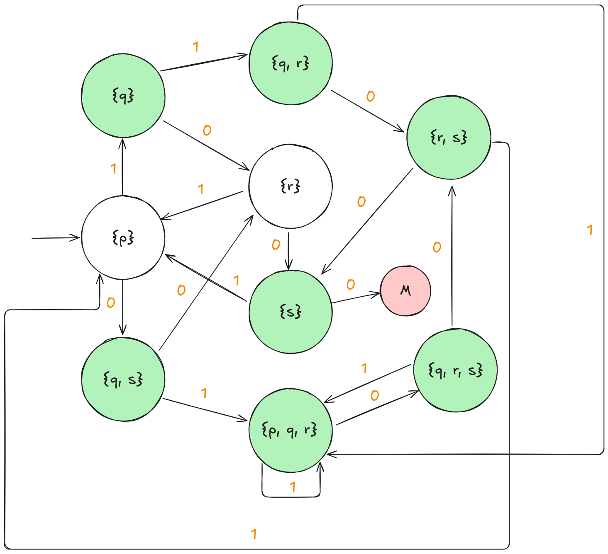

## Descrição Formal

- *Q*: { { p }, { p, q, r }, { q }, { q, r }, { q, r, s }, { q, s }, { r }, { r, s }, { s } },
- Σ: { 0, 1 },
- δ: **consultar tabela**,
- q₀: { p },
- *F*: { { p, q, r }, { q }, { q, r }, { q, r, s }, { q, s }, { r, s }, { s } }

# Exercício 3

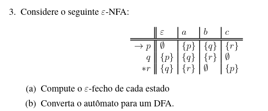

## a) Compute o ε-fecho de cada estado

ε-fecho(p) = { p }
ε-fecho(q) = { q, p }
ε-fecho(r) = { r, q, p }

## b) Converta o autômato para um AFD.

### Tabela de Transições

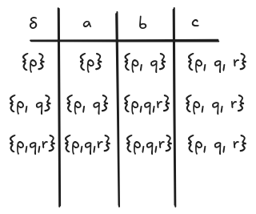

### Desenho

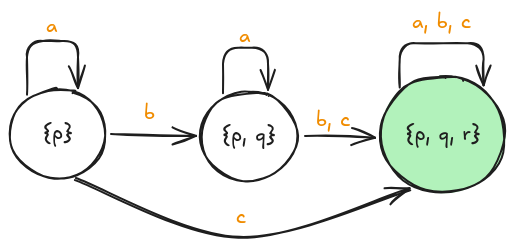

### Descrição Formal

- *Q*: { { p }, { p, q }, { p, q, r } }, 
- Σ: { a, b },
- δ: **consultar tabela**,
- q₀: { p },
- *F*: { { p, q, r } }

# Exercício 4

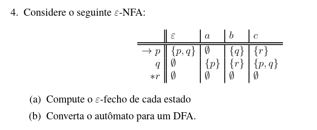

## a) Compute o ε-fecho de cada estado

ε-fecho(p) = { p, q }
ε-fecho(q) = { q }
ε-fecho(r) = { r }

## b) Converta o autômato para um AFD.

### Tabela de Transições

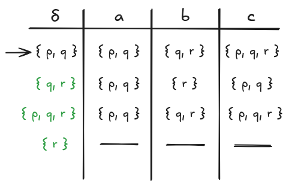

### Desenho

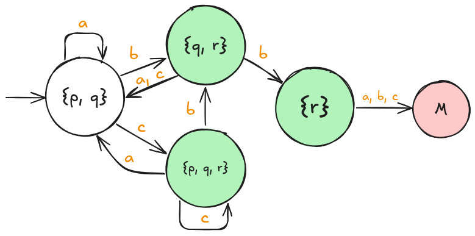

### Descrição Formal

- *Q*: { { p, q }, { p, q, r }, { q, r }, { r } }, 
- Σ: { a, b, c },
- δ: **consultar tabela**,
- q₀: { p, q },
- *F*: { { p, q, r }, { q, r }, { r } }